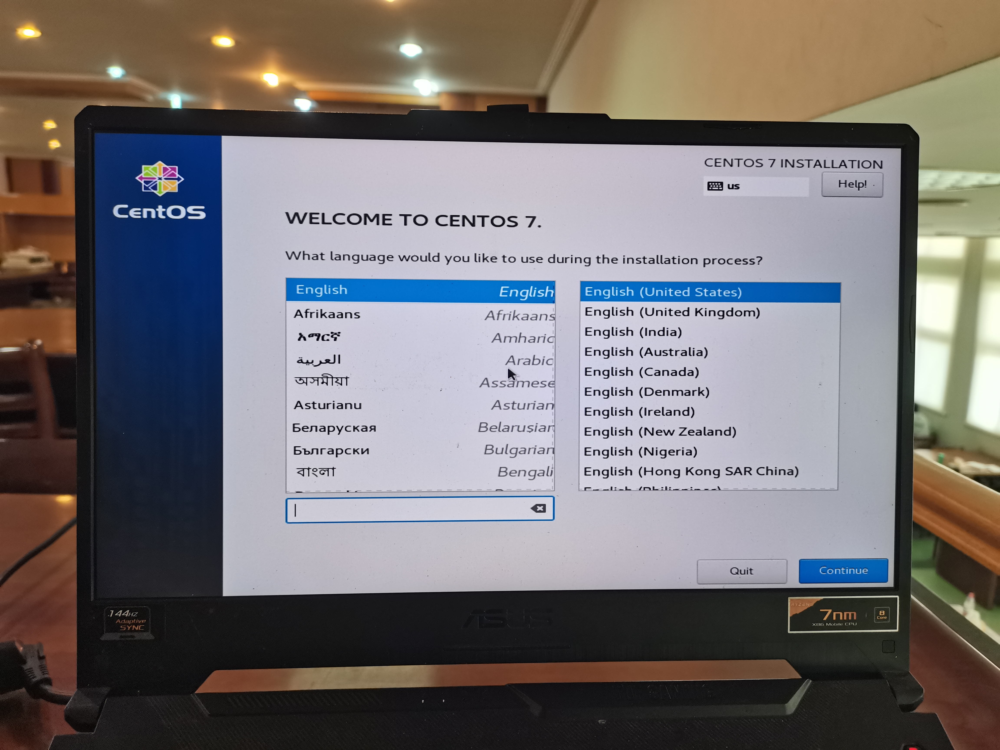
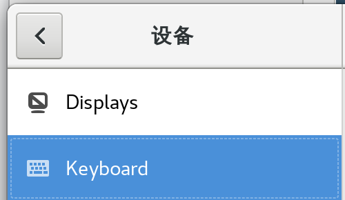
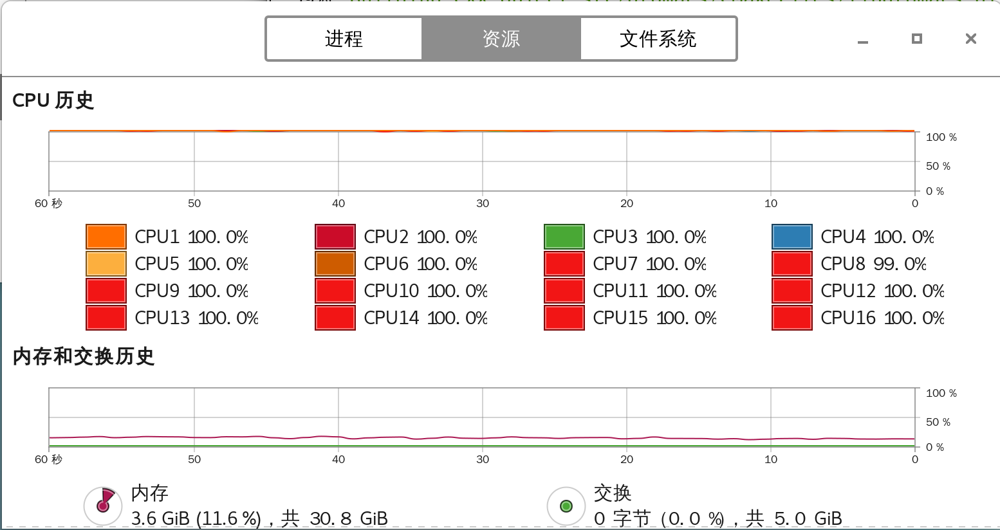
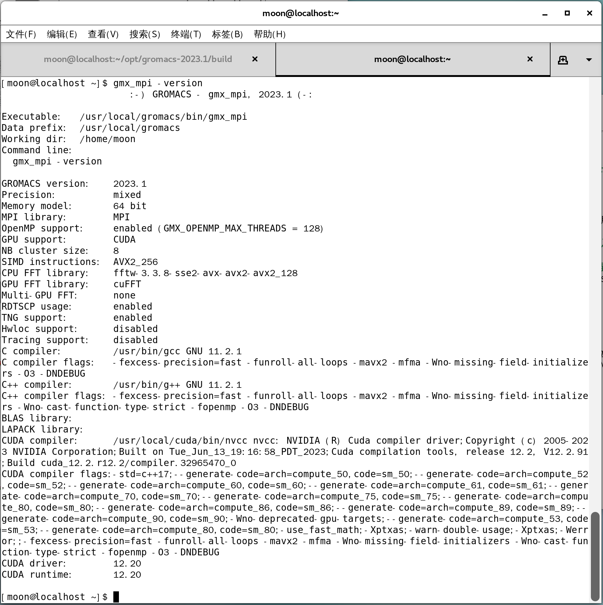

# 从零开始，安装基于centos7.9系统的lammps等科学计算软件

本文主要介绍基于centos7.9双系统的基础linux使用方法和lammps等科学软件的安装方法，并且给出对应的*gpu加速包*的安装方法。

安装方法均来自官网（会给出链接），安装需要的包也会以百度网盘的链接给出。

放一个qq联系方式，有问题的情况欢迎咨询。

对于从未接触过linux系统的同学，完成这份教程需要的东西：
1. 一台带nvidia独立显卡的笔记本电脑（个人使用的台式电脑也可以）。
2. 电脑中需要有空白的/可被格式化的磁盘（若使用小模型，50GB空余空间即可）
2. （假设电脑里已经有windows系统）提前做好重要数据的备份。打个压缩包传网盘为上策。
3. 一个16GB及以上的u盘，usb3.0及以上的速度最佳。
4. 做好心理准备，可能要花费3至5小时的时间。

由于gpu包的安装依赖显卡驱动，所以目前的方法是在实体机上安装双系统

> 后续如果在windows使用gpu加速的反馈足够多，会考虑出一期wsl2的安装教程
>
> 绝大多数使用现代nvidia显卡的机器都可以使用cuda加速，具体如何辨别下面会详细说明

## centos系统的安装

### 系统的选择和下载

首先我们需要去[镜像网站](https://mirrors.tuna.tsinghua.edu.cn/centos/7.9.2009/isos/x86_64/)官网下载一个iso文件用于安装，这里选择CentOS-7-x86_64-DVD-2009.iso即可


### 启动盘的制作

我们光有一个iso文件是没有办法把ubuntu系统装进硬盘里的，这时候就需要[ventoy](https://www.ventoy.net/cn/index.html)这个工具。

使用前请先将u盘数据备份好

#### 下载ventoy

使用windows版本。找一个[镜像](https://mirrors.nju.edu.cn/github-release/ventoy/Ventoy/LatestRelease/)下载即可。


#### 使用ventoy格式化硬盘

运行`Ventoy2Disk.exe`，选择你的u盘，然后点击`安装`即可


#### ventoy的使用

直接将上文下载的iso文件复制进你的u盘里，右下角选择安全弹出即可（也可以选择下一步调整磁盘空间完成后再弹出）。

### 调整磁盘空间

我们需要大于50GB的空间用于安装系统和软件（越大越好），对于需要双系统的情况，使用windows自带的`磁盘管理`工具即可完成。

首先，右击此`电脑`，选择`管理`


`计算机管理`左侧窗口，选择`磁盘管理`，可以看到你当前拥有的磁盘（一行一行的）


选择一个大于50GB，且空闲空间大于50GB的分区，右击，`压缩卷`


`输入压缩空间量(MB)`输入51200，选择`压缩`


输出如下表示成功：


### 正式安装系统

>  这一部分图片已经拍好，等其他部分教程做好后用photoshop做一下文档矫正

#### 调整启动项

搜索你的电脑型号（台式机搜索主板型号）如何进入bios

> 关于启动项

开机，进入bios调整启动项（英文叫做boot），以你的u盘为第一启动项。


> 在尚未正式进入系统之前，（多数情况下）使用`上下方向键`移动光标，`回车enter键`表示确认选择


退出后会自动重启，进入ventoy，如图


#### 选择你需要的系统

这里我们选择`centos7.9`，`回车`确认


选择`以正常模式启动`，回车


#### 加载完成后，开始安装

选择Test this media & install Centos 7，按`E`键编辑安装选项


上下左右键调整光标位置，在`quiet`前添加`monodeset`。

> 这样做是为了防止自带驱动和nvidia显卡冲突
> 笔者第一次安装时就是没有图形界面的，过于痛苦


输入完成后：


Install部分，左侧语言部分，滑动，在下面可以找到`简体中文`，右下角选择继续



安装信息摘要部分，先看`软件选择`


基本环境选择`gnome桌面`，已选环境的附加选项选择`GNOME应用程序`，左上角单击`完成`完成设置


系统部分，单击`安装位置`进入设置


单击右下角`刷新`，找到自己当时压缩分区的硬盘，选中。其他储存选项选择`自动配置分区`即可。左上角单击`完成`完成设置


设置完成，单击右下角`开始安装`


两个用户设置。先设置`ROOT密码`，单击进入设置。左上角单击`完成`完成设置。


`创建用户`，全名不必填写。

> 这里有一点`将此用户做为管理员`，笔者安装时忘记勾选了导致后续需要用命令添加sudoer权限
> 不过这里不选，安装完成后再手动设置，也有利于后续linux的学习和使用


等待安装完成，自动重启。重启时记得在合适的时机把u盘拔了。

#### 安装完成，进入系统并完成必须的设置

开机首先选择启动项，上下键选择`Centos Linux`开头的第一个选项，回车进入系统


初始设置里，点进`许可证`，同意退出即可


语言选择`汉语`，继续


输入选择`汉语（Intelligent Pinyin）`，前进


WiFi`跳过`，关闭`位置服务`，暂不连接`在线帐号`，完成基本设置

##### 关于linux的介绍

以下是我的一些个人理解：

linux是一种专注于高性能计算的系统，它的重心落在如何让整个系统更适合编程和长时间运行，由此省略了很多图形化的界面，绝大部分工作我们都可以在终端Terminal中，以敲命令的形式完成。这种做法就像五笔输入法一样，一开始痛苦的很，熟悉了之后整个效率会有很大提升的。

在centos系统中，我们调出的这个，就叫终端：


在终端里，你几乎可以做成任何事！

输入完命令后需要enter一下表示命令结束了，让计算机执行命令

为保持文档的连续性，一次性会给出多条命令，但是执行时建议逐条运行以便排查错误代码

##### 设置终端快捷键

为了保持习惯，我们仍然选择`ctrl+alt+T`作为终端的快捷键。左上角选择“应用程序—系统工具—设置”，进入设置面板


左侧工具栏选择`设备`，选择`Keyboard`



拉到最后，点击最下面的小`+`号


第二行按照我的内容输入（第一行随意，自己知道这个快捷键是用来干什么就行）


单击`Set Shortcut`，按住`ctrl+alt+T`完成设置，单击`添加`即可


尝试一下`ctrl+alt+T`看看能不能弹出。

##### 添加sudo权限

`ctrl+alt+T`调出终端，依次输入并执行，执行后会跳出一个文本编辑器窗口：

```bash
su
gedit /etc/sudoers
```

滑到最下面，找到倒数第四个蓝色行。选中从`wheel`开头到结尾的内容，复制到新的空白行并将`wheel`改成你自己的用户名，如图：


完成后保存退出即可。

##### 换源

> linux中，很多软件都已经提前被开发者测试打包好了，只需要一条命令即可下载
> 但是centos负责运营的开发者大多在国外，下载速度实在无法忍受
> 于是就有国内的好兄弟下好了放在国内的服务器里，我们只需要把系统内软件下载的链接换成国内的就好了

这里我换的是[清华大学镜像源](https://mirrors.tuna.tsinghua.edu.cn/help/centos/)，具体方法他们也写在链接里了（但不知道为啥`更新软件包缓存`这一步没有）

我们先换源。`ctrl+alt+T`调出终端，复制命令并粘贴（无输出是正常的）：

```bash
sudo sed -e 's|^mirrorlist=|#mirrorlist=|g' \
         -e 's|^#baseurl=http://mirror.centos.org/centos|baseurl=https://mirrors.tuna.tsinghua.edu.cn/centos|g' \
         -i.bak \
         /etc/yum.repos.d/CentOS-*.repo
```

后续操作，可能需要等待一段时间（并且会输出一段长长的代码）

```bash
#清理旧包
yum clean all
#生成yum源缓存
yum makecache
#更新yum源
sudo yum update -y
```

## nvidia驱动和cuda的安装

### 首先安装必须的包

输入后回车，等待安装完成即可。
```bash
sudo yum install cmake python3 axel fftw3 mpich openssl openssl-devel patch voro++  -y
```

### nvidia驱动的安装

> 这一步大概率很煎熬，做好心里准备

首先我们输入命令`nvidia-smi`，查看系统里是否已经有了nvidia的显卡驱动。输出如下：


无输出，需要自己打驱动了

#### 安装前的准备

先装必备的依赖包（后面有需要的再另外装）：gcc、kernel-devel、dkms

其中，`kernel-devel`包需要和当前系统内核版本一致，查看方法如下：

```bash
#查看系统内核版本
uname -r
#查看安装的kernel-devel版本
yum list | grep kernel-devel
```

若输出数字无差别，则可正常安装，例如（这里记下来，后面有用）：


安装依赖，执行后等待输出`完毕！`即可：

```bash
sudo yum install kernel-devel gcc dkms kernel-doc kernel-headers gcc\* glibc\* glibc-\* -y
```

#### 驱动的下载

[下载地址](https://www.nvidia.cn/Download/index.aspx?lang=cn)来自nvidia，自行寻找适合当前系统的版本

说是驱动最好不要放在一个文件夹里，所以我们新建一个文件夹，`ctrl+alt+T`打开终端：

```bash
#新建两个文件夹，opt和nvidia
mkdir opt nvidia
#切换到下载文件夹
cd 下载
#将英伟达驱动移动到根目录的nvidia文件夹里
cp NVIDIA-Linux-x86_64-535.54.03.run /home/moon/nvidia/
#进入nvidia文件夹
cd nvidia
#看看有没有驱动程序
ls
```

#### 禁用系统自带驱动

centos一般自带了针对nvidia显卡的开源驱动程序nouveau，但这个驱动没办法满足我们的需要。首先查看该驱动是否存在：

```bash
lsmod | grep nouveau
```

若无输出，则不存在该驱动；

若输出如下，则需要禁用系统自带驱动：


执行如下命令：
```bash
#提供权限
su
#将自带驱动设置进黑名单
echo -e "blacklist nouveau\noptions nouveau modeset=0" > /etc/modprobe.d/blacklist.conf
#备份当前initramfs机制，并更改为更新的
mv /boot/initramfs-$(uname -r).img /boot/initramfs-$(uname -r).img.bak
dracut /boot/initramfs-$(uname -r).img $(uname -r)
```

#### 安装nvidia驱动

`ctrl+alt+T`新开一个终端：
```bash
#进入nvidia文件夹
cd nvidia
#赋予驱动程序运行权限
chmod u+x NVIDIA-Linux-x86_64-535.54.03.run 
sudo ./NVIDIA-Linux-x86_64-535.54.03.run --kernel-source-path=/usr/src/kernels/3.10.0-1160.92.1.el7.x86_64 -k $(uname -r) 
```

报错：


输入`init 3`，进入命令行模式，重复执行上一条命令：

```bash
init 3
```

进入纯命令行模式，输入用户名，回车，输入密码，回车，登陆账户：


`cd`进入nvidia文件夹，方向键向上调用之前的`sudo`命令：


这一步选择`no`（左右方向键选择，回车键确认）


无视两个`warning`，继续下一步：


选择`Yes`，继续：


失败了，继续：

> 这个东西的大意应该是说，装上去了之后要是内核改变了，驱动会自动跟着改变
> 不过centos7.9 2024年就停止更新了，内核变化也不会太大了


选择`no`，继续


看到这里，恭喜，安装完成了：


安装完成，屏幕左下角会出现终端，输入下列命令回到图形界面：

```bash
init 5
```

输入密码后自动重启：


#### 检测nvidia驱动

输入：

```bash
nvidia_smi
```

若输出如下则安装完成：


### cuda toolkit的安装

#### cuda toolkit版本的选择和下载

这一部分我们首先需要选择适合当前驱动和显卡的cuda版本号

根据上述`nvidia-smi`的信息，右上角表示与当前驱动兼容的cuda版本为12.2

cuda toolkit的[下载链接](https://developer.nvidia.cn/cuda-toolkit-archive)

点击进入链接，选择cuda 12.0.0。

依次选择`Linux`，`x86_64`，`Centos`，`7`，`runfile(local)`，运行下述官方命令

```bash
#表示切换到`下载`文件夹，直接堆在根目录实在不太雅观
cd 下载
# wget命令是从网站上下载资源的方式，你直接复制链接到浏览器下载是一样的
# 要是嫌wget下载速度太慢，可以学习使用axel多线程下载技术，在特定情况下速度可以提升很多
wget https://developer.download.nvidia.com/compute/cuda/12.2.0/local_installers/cuda_12.2.0_535.54.03_linux.run
```

#### cuda toolkit的安装

这里的每一步都有概率会很慢，做好心理准备

```bash
#sh命令可以理解成执行终端中的可执行文件
sudo sh cuda_12.2.0_535.54.03_linux.run
```

> 这一步和之前一样，在终端中我们使用上下方向键进行选择，回车键用于确认

询问我们是否接受`End User License Agreement`，输入`accept`并回车表示确定


下面开始调整安装选项。


> 在这里，[X]表示选项被选中，[ ]表示没有被选中，使用enter在两种状态之间调节

我们已经安装了nvidia驱动，所以第一个`Driver`选项必须取消。最后移动光标到`Install`，回车安装，等待安装完成。


安装完成后，出现如下窗口：


#### 环境变量的设置

> 关于环境变量

我们`ctrl+alt+T`打开一个终端，在其中输入如下命令：
```bash
#cd单独使用回到home目录
cd
#bash命令行的环境变量储存在home根目录下的.bashrc文件中
sudo gedit .bashrc
```

在弹出的记事本里最后一行添加如下代码：
```bash
export PATH=/usr/local/cuda-12.0/bin:$PATH
export LD_LIBRARY_PATH=/usr/local/cuda-12.0/lib64:$LD_LIBRARY_PATH
export PATH=/usr/lib64/mpich/bin:$PATH
```
`ctrl+S`保存后退出。

#### 测试安装是否完成

`ctrl+alt+T`新开一个终端窗口，输入如下命令：

```bash
#which命令可以理解为用于查找命令文件,能够快速搜索二进制程序所对应的位置
which nvcc
#nvcc -V的意思是检测NVIDIA CUDA Compiler的版本
nvcc -V
```
输出如下，代表安装成功：


> 实际上有更精确的验证安装的方法，如果后续问题比较多的话再写进来

## 几个科学软件安装的方法

和前面 必备的包 和 驱动 不同，科学软件大多没有提供打包好的版本
（或者打包好的缺乏一些特定的包），需要从源码编译安装。使用这些软件的老师同学大多比我更了解这些软件是做什么用的，我就不介绍这些了。

安装顺序从简单到复杂，操作是在根目录新建一个`opt`文件夹，新建不同的文件夹用于安放不同的软件。

`ctrl+alt+T`新开一个终端，操作如下：

```bash
mkdir opt && cd opt
```

### GPUMD

#### 升级gcc版本

centos还在用的4.8.5不支持c++11的特性。

```bash
#安装 centos-release-scl
sudo yum install centos-release-scl -y
#安装 devtoolset，注意，如果想安装 7.*版本的，就改成 devtoolset-7-gcc*，以此类推
sudo yum install devtoolset-11-gcc* -y
#激活对应的 devtoolset
scl enable devtoolset-11 bash
#为新版本的gcc和g++创建软连接
ll /opt/rh/devtoolset-11/root/bin/gcc
ll /usr/bin/g++ 
#备份
sudo mv /usr/bin/gcc /usr/bin/gcc-4.8.5
sudo mv /usr/bin/g++ /usr/bin/g++-4.8.5
#链接到新版本
ln -s /opt/rh/devtoolset-11/root/bin/gcc /usr/bin/gcc
ln -s /opt/rh/devtoolset-11/root/bin/g++ /usr/bin/g++
```

`ctrl+alt+T`打开一个终端，在其中输入如下命令：
```bash
#cd单独使用回到home目录
cd
#bash命令行的环境变量储存在home根目录下的.bashrc文件中
sudo gedit .bashrc
```

在弹出的记事本里最后一行添加如下代码：
```bash
export CC=/usr/bin/gcc
export CXX=/usr/bin/g++
```
`ctrl+S`保存后退出。

`ctrl+alt+T`新开一个终端窗口，输入如下命令：

```bash
#检查当前版本
gcc --version
g++ --version
```

输出如下，表示安装成功：


#### 下载并解压源码包

[github下载链接](https://github.com/brucefan1983/GPUMD/releases/tag/v3.8)

输入如下命令：
```bash
cd
cd opt
#下载gpumd的源码包
##不知道为何，这样下载会很慢。直接访问上面的下载链接直接下载.tar.gz结尾的文件就行了 
wget https://github.com/brucefan1983/GPUMD/archive/refs/tags/v3.8.tar.gz
#解压压缩包
##在命令行里，针对当前文件夹里名称较长的文件，可以先输入前几个字母，然后使用`tab`键自动保存
tar -zxvf GPUMD-3.8.tar.gz
cd GPUMD-3.8/
ls
```

#### 安装gpumd

（这部分代码与上面一部分的代码是连续的，如果需要新开一个终端会单独说）输入下列命令：
```
#进入src文件夹
cd src
#编译，回车后需要等待较长时间
#调用16核预编译
make -j 16
#查看编译完成的变化
ls
```
编译完成后ls命令的结果，出现`gpumd`和`nep`两个文件说明安装完成：


#### 添加环境变量

我们在终端中输入如下命令：
```bash
#cd单独使用回到home目录
cd
#bash命令行的环境变量储存在home根目录下的.bashrc文件中
sudo gedit .bashrc
```

在弹出的记事本里最后一行添加如下代码：
```bash
export PATH=/home/moon/opt/GPUMD-3.8/src:$PATH
```
`ctrl+S`保存后退出。

#### 验证安装是否成功

`ctrl+alt+T`新开一个终端窗口，输入如下命令：
```bash
cd opt/GPUMD-3.8/examples
cd 01_Carbon_examples_for_JCP_2022_paper/A_lattice_constant/
#y运行gpumd，测试
gpumd
```

如果安装成功，屏幕输出如下：


### lammps

#### 升级cmake版本

cmake官网[下载链接](https://cmake.org/files/v3.18/)

cmake基本安装过程：

```bash
cd opt
#下载不下来就用我发的版本
wget https://cmake.org/files/v3.18/cmake-3.18.4.tar.gz
tar -zxvf cmake-3.18.4.tar.gz 
cd cmake-3.18.4/
#安装3.18cmake
./bootstrap && make -j 16 && sudo make install
#卸载旧版cmake
sudo yum erase cmake
#创建软链接
sudo ln-s /usr/local/bin/cmake /bin/cmake
```

检查cmake版本，输入：

```bash
cmake -version
```

若输出如下，则安装成功：


#### 升级python版本

```bash
cd ~/opt
wget https://www.python.org/ftp/python/3.8.0/Python-3.8.0.tgz
tar -zxvf Python-3.8.0.tgz
cd Python-3.8.0/
#安装3.8版本python
./configure
make -j 16 && make install -j 16
#备份原有python，创建软链接
sudo mv /usr/bin/python /usr/bin/python2.bak
sudo mv /usr/bin/python3 /usr/bin/python3.bak
sudo ln -s ~/opt/Python-3.8.0/python /usr/bin/python3
#复制动态库
sudo cp ~/opt/Python-3.8.0/libpython3.8.a /usr/lib64/
```


#### mpich的安装

版本为：mpich-4.1.2 (stable release)，下载[链接](https://www.mpich.org/downloads/)来自mpich官网，也可以使用下面的命令完成下载安装：

```bash
cd opt
wget https://www.mpich.org/static/downloads/4.1.2/mpich-4.1.2.tar.gz
tar -zxvf mpich-4.1.2.tar.gz
cd mpich-4.1.2
mkdir build
#这一步选定安装路径
./configure --prefix=/opt/mpich-4.1.2/build  --enable-shared=yes
sudo make -j 16 && sudo make install -j 16
```

我们`ctrl+alt+T`打开一个终端，在其中输入如下命令：
```bash
#cd单独使用回到home目录
cd
#bash命令行的环境变量储存在home根目录下的.bashrc文件中
sudo gedit .bashrc
```

在弹出的记事本里最后一行添加如下代码：
```bash
export PATH=/home/moon/opt/mpich-4.1.2/build/bin:$PATH
```
`ctrl+S`保存后退出。

`ctrl+alt+T`新打开一个终端，输入如下命令：
```bash
which mpirun
which mpiexec
```

若输出如下，则安装完成：


#### 下载并解压源码包

lammps [官方下载链接](https://www.lammps.org/download.html)

输入如下命令：
```bash
cd
cd opt
#下载lammps的源码包
##直接访问上面的下载链接，下载.tar.gz结尾的文件亦可
##这里下载LAMMPS Stable Release的最新版本就行
wget https://download.lammps.org/tars/lammps-stable.tar.gz
#解压压缩包
tar -zxvf lammps-stable.tar.gz 
cd lammps-23Jun2022/
ls
```

#### 下载必备的包并修改cmake文件

首先把需要的两个包下载到lammps下新建的`opt`目录中

```bash
cd ~/opt/lammps-23Jun2022/
mkdir opt && cd opt
wget https://download.lammps.org/thirdparty/voro++-0.4.6.tar.gz https://download.lammps.org/thirdparty/eigen-3.4.0.tar.gz
cd ..
```

修改cmake文件，将上述两个压缩包的链接从网页链接改成本地链接
```bash
cd cmake/Modules/Packages/
gedit MACHDYH.cmake VORONOI.cmake 
```
找到这一行，将原来的内容复制一行并使用`#`注释掉，将变量`${LAMMPS_THIRDPARTY_URL}`改成下载路径：

```cmake
#MACHDYH.cmake文件
set(EIGEN3_URL "${LAMMPS_THIRDPARTY_URL}/eigen-3.4.0.tar.gz" CACHE STRING "URL for Eigen3 tarball")
#VORONOI.cmake文件
set(VORO_URL "${LAMMPS_THIRDPARTY_URL}/voro++-0.4.6.tar.gz" CACHE STRING "URL for Voro++ tarball")
```
修改后的代码如图所示，保存后退出：

```cmake
##MACHDYH.cmake文件
#set(EIGEN3_URL "${LAMMPS_THIRDPARTY_URL}/eigen-3.4.0.tar.gz" CACHE STRING "URL for Eigen3 tarball")
set(EIGEN3_URL "/home/moon/opt/lammps-23Jun2022/opt/eigen-3.4.0.tar.gz" CACHE STRING "URL for Eigen3 tarball")
##VORONOI.cmake文件
#set(VORO_URL "${LAMMPS_THIRDPARTY_URL}/voro++-0.4.6.tar.gz" CACHE STRING "URL for Voro++ tarball")
set(VORO_URL "/home/moon/opt/lammps-23Jun2022/opt/voro++-0.4.6.tar.gz" CACHE STRING "URL for Voro++ tarball")
```

#### 安装lammps本体

安装方法参考来自lammps的[官方文档](https://docs.lammps.org/stable/Manual.html)

> 传统的安装方法是使用make，这里使用cmake就好了

安装的包选择来自官方的cmake预设包`most.cmake`

```cmake
# preset that turns on a wide range of packages, some of which require
# external libraries. Compared to all_on.cmake some more unusual packages
# are removed. The resulting binary should be able to run most inputs.

set(ALL_PACKAGES
  ASPHERE
  BOCS
  BODY
  BPM
  BROWNIAN
  CG-DNA
  CG-SDK
  CLASS2
  COLLOID
  COLVARS
  COMPRESS
  CORESHELL
  DIELECTRIC
  DIFFRACTION
  DIPOLE
  DPD-BASIC
  DPD-MESO
  DPD-REACT
  DPD-SMOOTH
  DRUDE
  ELECTRODE
  EFF
  EXTRA-COMPUTE
  EXTRA-DUMP
  EXTRA-FIX
  EXTRA-MOLECULE
  EXTRA-PAIR
  FEP
  GRANULAR
  INTERLAYER
  KSPACE
  MACHDYN
  MANYBODY
  MC
  MEAM
  MISC
  ML-IAP
  ML-SNAP
  MOFFF
  MOLECULE
  OPENMP
  OPT
  ORIENT
  PERI
  PHONON
  PLUGIN
  POEMS
  QEQ
  REACTION
  REAXFF
  REPLICA
  RIGID
  SHOCK
  SPH
  SPIN
  SRD
  TALLY
  UEF
  VORONOI
  YAFF)

foreach(PKG ${ALL_PACKAGES})
  set(PKG_${PKG} ON CACHE BOOL "" FORCE)
endforeach()

set(BUILD_TOOLS ON CACHE BOOL "" FORCE)
```

安装命令如下（仍然是和上面的命令相承）：

> ` -D GPU_ARCH=value`中的`value`值需要自行登陆[wiki链接](https://en.wikipedia.org/wiki/CUDA#GPUs_supported)或者[nvidia链接](https://developer.nvidia.com/cuda-gpus#collapseOne)查看，表示为`sm_XX`
>
> 我的显卡是RTX 2060(mobile)，这个值应该是sm_75（网站上的值略去小数点）
>
> 可以使用之前的`nvidia-smi`命令查看自己的显卡型号

```bash
cd opt/lammps/lammps-23Jun2022/
mkdir build
cd build
#这一行命令确实太长了
cmake -C ../cmake/presets/most.cmake -D PKG_GPU=yes -D GPU_API=cuda -D GPU_ARCH=sm_75 DOWNLOAD_VORO=yes  DOWNLOAD_EIGEN3=yes ../cmake
```

输出如下，表示cmake预编译完成：


继续依次输入下述命令并执行：

```bash
#调用16线程一起make
##这一步等待时间也很漫长
make -j 16
#要是不报错的话直接继续就好了
#有warning也不用管太多，看一眼心里有数就行
make install -j 16
```

#### 添加环境变量

在终端中输入如下命令：
```bash
#cd单独使用回到home目录
cd
#bash命令行的环境变量储存在home根目录下的.bashrc文件中
sudo gedit .bashrc
```

在弹出的记事本里最后一行添加如下代码：
```bash
export PATH=/home/moon/opt/lammps-23Jun2022/build:$PATH
```
`ctrl+S`保存后退出。

#### 验证安装是否成功

`ctrl+alt+T`新开一个`终端`，输入如下命令：

```bash
cd
cd /home/moon/opt/lammps/lammps-23Jun2022/examples/KAPPA
#首先用纯cpu跑一遍
#输出大量数据则安装成功
mpirun -np 16 lmp  -in in.heat
```

纯cpu跑的，可以在系统监视器里看到一个明显的`峰值`：


```bash
#这次试着用显卡跑一下
## -sf gpu -pk gpu 表示调用的gpu，之所以是gpu1不是gpu0,个人猜测是笔记本没有独显直连，核显才是gpu0
##由于使用的是example里的小模型，具体加速效果也就图一乐
mpirun -np 16 lmp -sf gpu -pk gpu 1 neigh no -in in.heat
```

输出如下则安装完成：


> cpu的使用情况，我们可以在`系统监视器`里看到
> 那么gpu的使用情况该如何了解呢？这就涉及到上面安装nvidia驱动时候的`nvidia-smi`命令了
> 在终端中输入`watch -n 2 nvidia-smi`，这样可以每隔2s输出一次`nvidia-smi`的内容，实现实时监控gpu使用情况：
> 

### GROMACS


#### 下载并解压源码包

gromacs [官方下载链接](https://manual.gromacs.org/current/download.html)

输入如下命令：

```bash
cd opt
#下载gromacs的源码包
##直接访问上面的下载链接使用http下载.tar.gz结尾的文件亦可 
wget https://ftp.gromacs.org/gromacs/gromacs-2023.1.tar.gz
#解压压缩包
tar -zxvf gromacs-2023.1.tar.gz
cd gromacs-2023.1/
ls
```

#### 安装gromacs本体

安装方法参考来自gromacs的[官方文档](https://manual.gromacs.org/current/install-guide/index.html)

> NVIDIA GPUs with at least NVIDIA compute capability 3.5 are required.

安装命令如下（仍然是和上面的命令相承）：
```bash
mkdir build
cd build
#GMX_MPI=on意为打开并行计算
#GMX_
cmake .. -DGMX_MPI=on -DGMX_GPU=CUDA -DCUDA_TOOLKIT_ROOT_DIR=/usr/local/cuda -DGMX_BUILD_OWN_FFTW=ON 

```

输出如下，表示cmake预编译完成：


继续依次输出下述命令：

```bash
#调用16线程一起make，具体数据可以在系统监视器里看
##这三步等待时间巨长，要是按照官方教程单核跑不知道要多久
make -j 16
make check -j 16
sudo make install -j 16
```

> 资源监视器的调出方法：
> 先按`win`键，然后用中文输入法输入`资源监视器`即可
> 选择``



#### 添加环境变量

在终端中输入如下命令：
```bash
#cd单独使用回到home目录
cd
#bash命令行的环境变量储存在home根目录下的.bashrc文件中
sudo gedit .bashrc
```

在弹出的记事本里最后一行添加如下代码（注释用于说明，无需复制）：
```bash
#这行代码来自官方，意思应该是在终端中输入
source /usr/local/gromacs/bin/GMXRC
#安装了mpich，所以可执行文件是在这个目录下的gmx_mpi
export PATH=/usr/local/gromacs/bin:$PATH
```
`ctrl+S`保存后退出。

#### 验证安装是否成功

我暂时还没有使用gmx的需要，在官方的[文档](https://manual.gromacs.org/current/user-guide/getting-started.html)里也没找到用于检测安装的输入文件，所以先用下面这个例子凑合了：

```bash
gmx_mpi -version
```

若输出如下，则安装成功：




