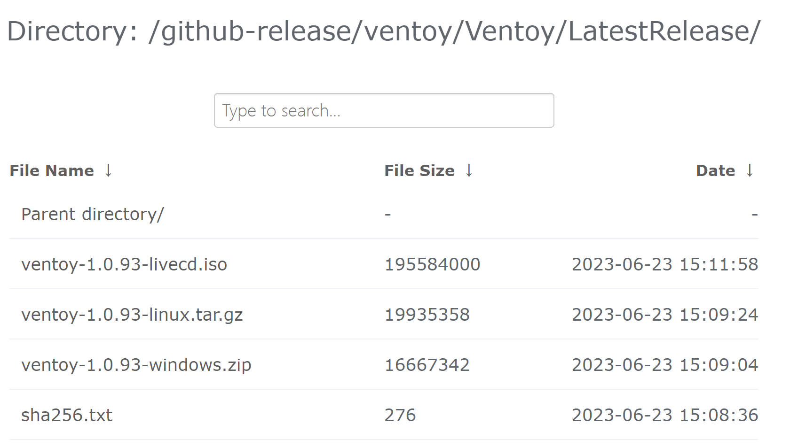
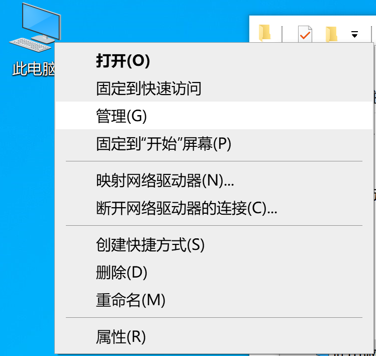
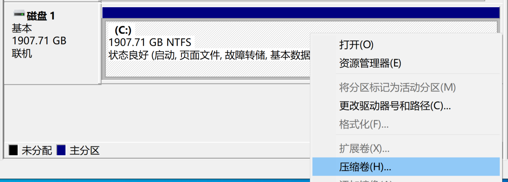
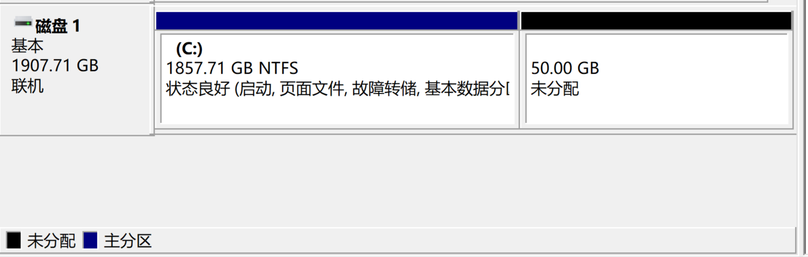
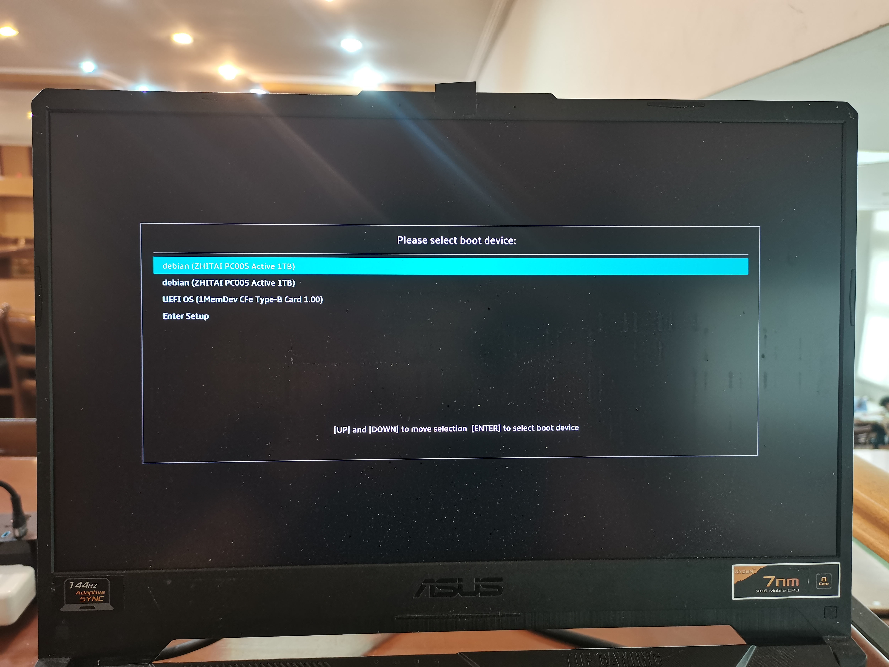
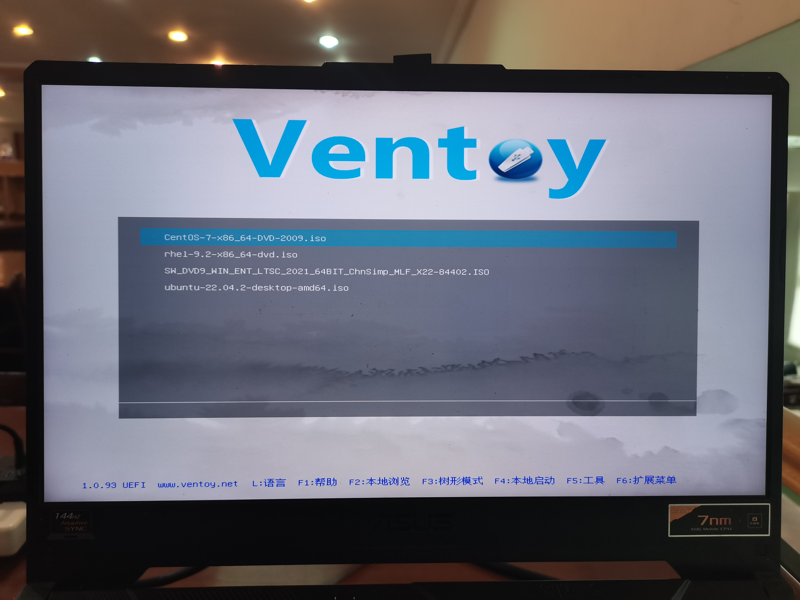
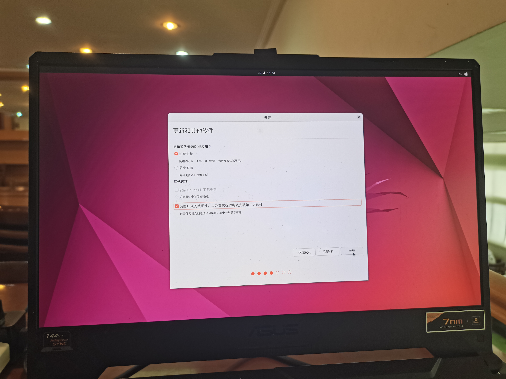

# 从零开始，安装基于ubuntu 22.04系统的lammps等科学计算软件

本文主要介绍基于ubuntu 22.04双系统的基础linux使用方法和lammps等科学软件的安装方法，并且给出对应的*gpu加速包*的安装方法。

安装方法均来自官网（会给出链接），安装需要的包也会以百度网盘的链接给出，

对于从未接触过linux系统的同学，完成这份教程需要的东西：
1. 一台带nvidia独立显卡的笔记本电脑（个人使用的台式电脑也可以）。
2. 电脑中需要有空白的/可被格式化的磁盘（若使用小模型，50GB空余空间即可）
2. （假设电脑里已经有windows系统）提前做好重要数据的备份。打个压缩包传网盘为上策。
3. 一个16GB及以上的u盘，usb3.0及以上的速度最佳。
4. 做好心理准备，可能要花费3至5小时的时间。

由于gpu包的安装依赖显卡驱动，所以目前的方法是在实体机上安装双系统

> 后续如果在windows使用gpu加速的反馈足够多，会考虑出一期wsl2的安装教程
>
> 绝大多数使用现代nvidia显卡的机器都可以使用cuda加速，具体如何辨别下面会详细说明

## ubuntu系统的安装

### 系统的选择和下载

首先我们需要去[ubuntu](https://cn.ubuntu.com/download/desktop)官网下载一个iso文件用于安装，这里选择Ubuntu 22.04.2 LTS即可

### 启动盘的制作

我们光有一个iso文件是没有办法把ubuntu系统装进硬盘里的，这时候就需要[ventoy](https://www.ventoy.net/cn/index.html)这个工具。

使用前请先将u盘数据备份好

#### 下载ventoy

使用windows版本。找一个[镜像](https://mirrors.nju.edu.cn/github-release/ventoy/Ventoy/LatestRelease/)下载即可。



#### 使用ventoy格式化硬盘

运行`Ventoy2Disk.exe`，选择你的u盘，然后点击`安装`即可


#### ventoy的使用

直接将上文下载的iso文件复制进你的u盘里，右下角选择安全弹出即可（也可以选择下一步调整磁盘空间完成后再）。

### 调整磁盘空间

我们需要大于50GB的空间用于安装系统和软件（越大越好），对于需要双系统的情况，使用windows自带的`磁盘管理`工具即可完成。

首先，右击此`电脑`，选择`管理`



`计算机管理`左侧窗口，选择`磁盘管理`，可以看到你当前拥有的磁盘（一行一行的）


选择一个大于50GB，且空闲空间大于50GB的分区，右击，`压缩卷`



`输入压缩空间量(MB)`输入51200，选择`压缩`


输出如下表示成功：



### 正式安装系统

>  这一部分图片已经拍好，等其他部分教程做好后用photoshop做一下文档矫正

#### 调整启动项

搜索你的电脑型号（台式机搜索主板型号）如何进入bios

> 关于启动项

开机，进入bios调整启动项（英文叫做boot），以你的u盘为第一启动项。



> 在尚未正式进入系统之前，（多数情况下）使用`上下方向键`移动光标，`回车enter键`表示确认选择


退出后会自动重启，进入ventoy，如图



#### 选择你需要的系统

这里我们选择`Ubuntu 22.04.2 LTS`，`回车`确认


选择`以正常模式启动`，回车


> 这里的图没拍到，等下装centos时补充一下

#### 加载完成后，开始安装

GNU GRUB部分，选择Try or Install Ubuntu，回车


Instal部分，左侧语言部分，滑动，在下面可以找到`简体中文`，在右侧选择安装Ubuntu


键盘布局均选择Chinese即可，继续


无线部分，选择“I don't want to connect ……”，继续


更新和其他软件，首先选择`正常安装`，其他选项中`为图形或无线硬件，以及其他，媒体格式……`，继续

> 这一步主要是为了方便打上nvidia驱动



**重点部分！这里的选择和我的图不一致！！！需要你根据自己的需求判断**

安装类型，提示“此台计算机已经安装了windows10”，该如何选择

若打算双系统同时存在于磁盘中，选择第一个即可，即“安装Ubuntu，与xxxx共存”

若不打算要windows系统了，纯用来装linux，选择第二个，即“清除整个磁盘并安装Ubuntu”


决定好之后，选择继续

下一步选择磁盘空间，装到你希望的那个盘里即可。保持默认安装，选择`现在安装`


确认`将改动写入磁盘`


地区选择`上海`


填写姓名，计算机名，用户名，设置密码，继续


等待，安装完成后重启


此时英文提示“请移除安装戒指，然后按回车键”。说人话就是把你的u盘拔出来再按enter键。


#### 安装完成，进入系统并完成必须的设置

敲击回车/单击中间的用户名，输入密码，回车，进入系统


欢迎使用Ubuntu中，依次选择`Skip for now`，`否，不发送系统信息`，`不允许定位`，`前进`


单击右上角，选择网络并设置，自行连接


##### 关于linux的介绍

以下是我的一些个人理解：

linux是一种专注于高性能计算的系统，它的重心落在如何让整个系统更适合编程和长时间运行，由此省略了很多图形化的界面，绝大部分工作我们都可以在终端Terminal中，以敲命令的形式完成。这种做法就像五笔输入法一样，一开始痛苦的很，熟悉了之后整个效率会有很大提升的。

在ubuntu系统中，我们使用组合键`ctrl+alt+T`调出的这个，就叫终端：


在终端里，你几乎可以做成任何事！

输入完命令后需要enter一下表示命令结束了

为保持文档的连续性，一次性会给出多条命令，但是执行时建议逐条运行以便排查错误代码

##### 换源

> linux中，很多软件都已经提前被开发者测试打包好了，只需要一条命令即可下载
> 但是ubuntu负责运营的开发者大多在国外，下载速度实在无法忍受
> 于是就有国内的好兄弟下好了放在国内的服务器里，我们只需要把系统内软件下载的链接换成国内的就好了

这里我换的是[清华大学镜像源](https://mirrors.tuna.tsinghua.edu.cn/help/ubuntu/)，具体方法他们也写在链接里了

我们`ctrl+alt+T`调出终端，输入：

```bash
#cd即change directory，更改当前文件夹，进入/etc/apt/文件夹的意思
cd /etc/apt/
#ls即list，意为列举当前文件夹内所有内容
ls
```
输出有
```bash
moon@FA506IV:~$ cd /etc/apt/
moon@FA506IV:/etc/apt$ ls
apt.conf.d   keyrings       sources.list    trusted.gpg.d
auth.conf.d  preferences.d  sources.list.d
```

其中，`sources.list`即为当前软件源，我们需要备份一下，然后把sources.list里的内容更换成清华的镜像源链接

输入命令：
```bash
#sudo意为调用管理员权限，cp即copy，这条命令的意思是把sources.list文件复制到sources.list.backup，起备份作用
sudo cp sources.list sources.list.backup
```
回车后会让你输入密码。为了保密，*输入密码时光标不会移动*，输入完毕后回车即可。

再输入ls查看当前文件夹（也叫当前路径）的文件，输出有：

```bash
moon@FA506IV:/etc/apt$ sudo cp sources.list sources.list.backup
[sudo] moon 的密码： 
moon@FA506IV:/etc/apt$ ls
apt.conf.d   keyrings       sources.list         sources.list.d
auth.conf.d  preferences.d  sources.list.backup  trusted.gpg.d
```

现在，我们开始换源。

输入：
```bash
sudo gedit sources.list
```

弹出一个类似记事本的编辑器，我们只要把清华镜像源的内容复制进去即可，`ctrl+S`保存后关闭。

复制后如下图：


完成后，输入如下命令，更新一下系统软件：
```bash
#回到一开始的Home文件夹
cd
#更新现在的软件
sudo apt update
```

## nvidia驱动和cuda的安装

### 首先安装必须的包

输入后回车，等待安装完成即可。
```bash
sudo apt-get install g++ gcc make cmake python3 axel neofetch fftw3 libfftw3-dev mpich -y
```

### nvidia驱动的安装

首先我们输入命令`nvidia-smi`，查看系统里是否已经有了nvidia的显卡驱动。输出如下：


有输出，说明nvidia驱动已经打上了

> 留一个qq号：2564647109，要是这一步有问题欢迎找我交流。
>
> 之前放弃使用Ubuntu20.04的原因就是nvidia驱动一直打不上去，所以不能确定**这次系统自带驱动**是个体原因还是啥。
>
> 事实上，笔者在撰写这篇文章时，系统驱动崩溃过一次，如果联系我的人多会对这部分进行更新说明。
>

### cuda toolkit的安装

#### cuda toolkit版本的选择和下载

这一部分我们首先需要选择适合当前驱动和显卡的cuda版本号

根据上述`nvidia-smi`的信息，右上角表示与当前驱动兼容的cuda版本为12.0

cuda toolkit的[下载链接](https://developer.nvidia.cn/cuda-toolkit-archive)

点击进入链接，选择cuda 12.0.0。

依次选择`Linux`，`x86_64`，`Ubuntu`，`22.04`，`runfile(local)`，运行下述官方命令

```bash
#表示切换到`下载`文件夹，直接堆在根目录实在不太雅观
cd 下载
# wget命令是从网站上下载资源的方式，你直接复制链接到浏览器下载是一样的
# 要是嫌wget下载速度太慢，可以学习使用axel多线程下载技术，在特定情况下速度可以提升很多
wget https://developer.download.nvidia.com/compute/cuda/12.0.0/local_installers/cuda_12.0.0_525.60.13_linux.run
```

#### cuda toolkit的安装

这里的每一步都有概率会很慢，做好心理准备

```bash
#sh命令可以理解成执行终端中的可执行文件
sudo sh cuda_12.0.0_525.60.13_linux.run
```

> 这一步和之前一样，在终端中我们使用上下方向键进行选择，回车键用于确认

提示已有驱动的安装包，我们移动光标到`Continue`，回车确认


询问我们是否接受`End User License Agreement`，输入`accept`并回车表示确定


下面开始调整安装选项。


> 在这里，[X]表示选项被选中，[ ]表示没有被选中，使用enter在两种状态之间调节

我们已经安装了nvidia驱动，所以第一个`Driver`选项必须取消。最后移动光标到`Install`，回车安装，等待安装完成。


安装完成后，出现如下窗口：


#### 环境变量的设置

> 关于环境变量

我们在终端中输入如下命令：
```bash
#cd单独使用回到home目录
cd
#bash命令行的环境变量储存在home根目录下的.bashrc文件中
sudo gedit .bashrc
```

在弹出的记事本里最后一行添加如下代码：
```bash
export PATH=/usr/local/cuda-12.0/bin:$PATH
export LD_LIBRARY_PATH=/usr/local/cuda-12.0/lib64:$LD_LIBRARY_PATH
```
`ctrl+S`保存后退出。

#### 测试安装是否完成

`ctrl+alt+T`新开一个终端窗口，输入如下命令：

```bash
#which命令可以理解为用于查找命令文件,能够快速搜索二进制程序所对应的位置
which nvcc
#nvcc -V的意思是检测NVIDIA CUDA Compiler的版本
nvcc -V
```
输出如下，代表安装成功：


## 几个科学软件安装的方法

和前面 必备的包 和 驱动 不同，科学软件大多没有提供打包好的版本
（或者打包好的缺乏一些特定的包），需要从源码编译安装。使用这些软件的老师同学大多比我更了解这些软件是做什么用的，我就不介绍这些了。

安装顺序从简单到复杂，操作是在根目录新建一个`opt`文件夹，新建不同的文件夹用于安放不同的软件。操作如下：

```bash
cd
mkdir opt
cd opt
mkdir lammps gpumd gromacs
```

### GPUMD

#### 下载并解压源码包

[github下载链接](https://github.com/brucefan1983/GPUMD/releases/tag/v3.8)

输入如下命令：
```bash
cd
cd opt/gpumd
#下载gpumd的源码包
##不知道为何，这样下载会很慢。直接访问上面的下载链接直接下载.tar.gz结尾的文件就行了 
wget https://github.com/brucefan1983/GPUMD/archive/refs/tags/v3.8.tar.gz
#解压压缩包
##在命令行里，针对当前文件夹里名称较长的文件，可以先输入前几个字母，然后使用`tab`键自动保存
tar -zxvf GPUMD-3.8.tar.gz
cd GPUMD-3.8/
ls
```

#### 安装gpumd

（这部分代码与上面一部分的代码是连续的，如果需要新开一个终端会单独说）输入下列命令：
```
#进入src文件夹
cd src
#编译，回车后需要等待较长时间
make
#查看编译完成的变化
ls
```
编译完成后如图所示：


ls命令的结果，出现gpumd和nep两个文件说明安装完成：


#### 添加环境变量

我们在终端中输入如下命令：
```bash
#cd单独使用回到home目录
cd
#bash命令行的环境变量储存在home根目录下的.bashrc文件中
sudo gedit .bashrc
```

在弹出的记事本里最后一行添加如下代码：
```bash
export PATH=/home/moon/opt/gpumd/GPUMD-3.8/src:$PATH
```
`ctrl+S`保存后退出。

#### 验证安装是否成功

`ctrl+alt+T`新开一个终端窗口，输入如下命令：
```bash
cd opt/gpumd/GPUMD-3.8/examples
cd 01_Carbon_examples_for_JCP_2022_paper/A_lattice_constant/
#y运行gpumd，测试
gpumd
```

如果安装成功，屏幕输出如下：


### GROMACS

#### 下载并解压源码包

gromacs [官方下载链接](https://manual.gromacs.org/current/download.html)

输入如下命令：
```bash
cd
cd opt/gromacs
#下载gromacs的源码包
##直接访问上面的下载链接使用http下载.tar.gz结尾的文件亦可 
wget https://ftp.gromacs.org/gromacs/gromacs-2023.1.tar.gz
#解压压缩包
tar -zxvf gromacs-2023.1.tar.gz
cd gromacs-2023.1/
ls
```

#### 安装gromacs本体

安装方法参考来自gromacs的[官方文档](https://manual.gromacs.org/current/install-guide/index.html)

> NVIDIA GPUs with at least NVIDIA compute capability 3.5 are required.

安装命令如下（仍然是和上面的命令相承）：
```bash
mkdir build
cd build
cmake .. -DGMX_MPI=on -DGMX_GPU=CUDA -DCUDA_TOOLKIT_ROOT_DIR=/usr/local/cuda 

```

输出如下，表示cmake预编译完成：


继续依次输出下述命令：

```bash
#调用16线程一起make，具体数据可以在系统监视器里看
##这一步等待时间巨长，要是按照官方教程单核跑不知道要多久
make -j 16
make check -j 16
sudo make install -j 16
```

资源监视器的调出方法：
先按`win`键，然后用中文输入法输入`资源监视器`即可


#### 添加环境变量

在终端中输入如下命令：
```bash
#cd单独使用回到home目录
cd
#bash命令行的环境变量储存在home根目录下的.bashrc文件中
sudo gedit .bashrc
```

在弹出的记事本里最后一行添加如下代码（注释用于说明，无需复制）：
```bash
#这行代码来自官方，意思应该是在终端中输入
source /usr/local/gromacs/bin/GMXRC
#安装了mpich，所以可执行文件是在这个目录下的gmx_mpi
export PATH=/usr/local/gromacs/bin:$PATH
```
`ctrl+S`保存后退出。

#### 验证安装是否成功

我暂时还没有使用gmx的需要，在官方的[文档](https://manual.gromacs.org/current/user-guide/getting-started.html)里也没找到用于检测安装的输入文件，所以先用下面这个例子凑合了：

```bash
gmx_mpi -version
```

若输出如下，则安装成功：


### lammps

#### 下载并解压源码包

lammps [官方下载链接](https://www.lammps.org/download.html)

输入如下命令：
```bash
cd
cd opt/lammps
#下载lammps的源码包
##直接访问上面的下载链接，下载.tar.gz结尾的文件亦可
##这里下载LAMMPS Stable Release的最新版本就行
wget https://download.lammps.org/tars/lammps-stable.tar.gz
#解压压缩包
tar -zxvf lammps-stable.tar.gz 
cd lammps-23Jun2022/
ls
```

#### 安装lammps本体

安装方法参考来自lammps的[官方文档](https://docs.lammps.org/stable/Manual.html)

> 传统的安装方法是使用make，但是这种方法还需要去修改makefile，实在是一件麻烦的事情
>
> 这里直接使用cmake就好了

安装的包选择来自官方的cmake预设包`most.cmake`

```cmake
# preset that turns on a wide range of packages, some of which require
# external libraries. Compared to all_on.cmake some more unusual packages
# are removed. The resulting binary should be able to run most inputs.

set(ALL_PACKAGES
  ASPHERE
  BOCS
  BODY
  BPM
  BROWNIAN
  CG-DNA
  CG-SDK
  CLASS2
  COLLOID
  COLVARS
  COMPRESS
  CORESHELL
  DIELECTRIC
  DIFFRACTION
  DIPOLE
  DPD-BASIC
  DPD-MESO
  DPD-REACT
  DPD-SMOOTH
  DRUDE
  ELECTRODE
  EFF
  EXTRA-COMPUTE
  EXTRA-DUMP
  EXTRA-FIX
  EXTRA-MOLECULE
  EXTRA-PAIR
  FEP
  GRANULAR
  INTERLAYER
  KSPACE
  MACHDYN
  MANYBODY
  MC
  MEAM
  MISC
  ML-IAP
  ML-SNAP
  MOFFF
  MOLECULE
  OPENMP
  OPT
  ORIENT
  PERI
  PHONON
  PLUGIN
  POEMS
  QEQ
  REACTION
  REAXFF
  REPLICA
  RIGID
  SHOCK
  SPH
  SPIN
  SRD
  TALLY
  UEF
  VORONOI
  YAFF)

foreach(PKG ${ALL_PACKAGES})
  set(PKG_${PKG} ON CACHE BOOL "" FORCE)
endforeach()

set(BUILD_TOOLS ON CACHE BOOL "" FORCE)
```

安装命令如下（仍然是和上面的命令相承）：

> ` -D GPU_ARCH=value`中的`value`值需要自行登陆[wiki链接](https://en.wikipedia.org/wiki/CUDA#GPUs_supported)或者[nvidia链接](https://developer.nvidia.com/cuda-gpus#collapseOne)查看，表示为`sm_XX`
>
> 我的显卡是RTX 2060(mobile)，这个值应该是sm_75（网站上的值略去小数点）
>
> 可以使用之前的`nvidia-smi`命令查看自己的显卡型号

```bash
cd opt/lammps/lammps-23Jun2022/
mkdir build
cd build
#这一行命令确实太长了
##
cmake -C ../cmake/presets/most.cmake  -D GPU_API=cuda -D GPU_ARCH=sm_75  ../cmake
```

输出如下，表示cmake预编译完成：


继续依次输入下述命令并执行：

```bash
#调用16线程一起make
##这一步等待时间也很漫长
make -j 16
#要是不报错的话直接继续就好了
#有warning也不用管太多，看一眼心里有数就行
make install -j 16
```

#### 添加环境变量

在终端中输入如下命令：
```bash
#cd单独使用回到home目录
cd
#bash命令行的环境变量储存在home根目录下的.bashrc文件中
sudo gedit .bashrc
```

在弹出的记事本里最后一行添加如下代码：
```bash
export PATH=/home/moon/opt/lammps/lammps-23Jun2022/build:$PATH
```
`ctrl+S`保存后退出。

#### 验证安装是否成功

`ctrl+alt+T`新开一个`终端`，输入如下命令：

```bash
cd
cd /home/moon/opt/lammps/lammps-23Jun2022/examples/KAPPA
#首先用纯cpu跑一遍
mpirun -np 16 lmp  -in in.heat
```

纯cpu跑的，可以在系统监视器里看到一个明显的`峰值`：


```bash
#这次试着用显卡跑一下
## -sf gpu -pk gpu 表示调用的gpu，之所以是gpu1不是gpu0,个人猜测是笔记本没有独显直连
##由于使用的是example里的小模型，具体加速效果也就图一乐
mpirun -np 16 lmp -sf gpu -pk gpu 1 neigh no -in in.heat
```

输出如下则安装完成：


